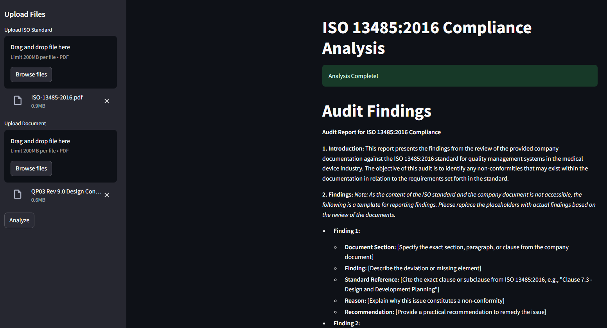
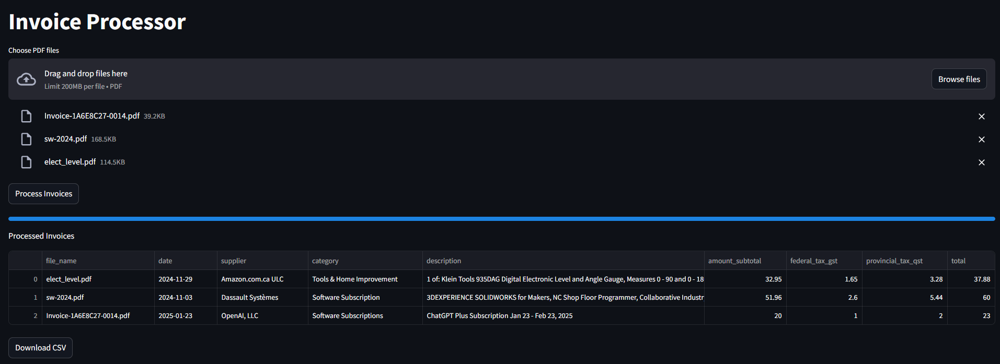
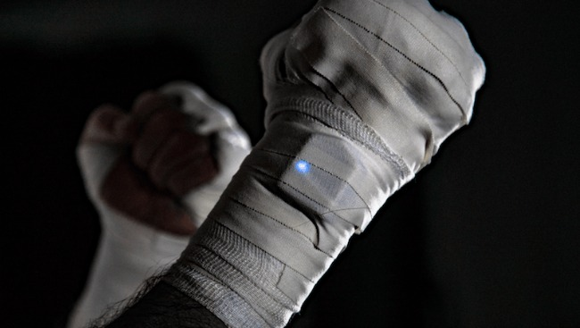
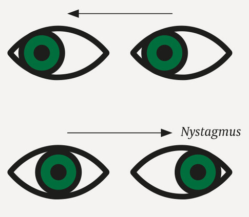
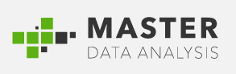
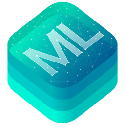
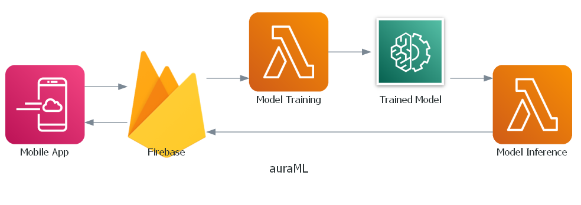

# Selected Projects (Simplified)

- **Automatic ISO Compliance Analysis:** A solution designed to automate the process of analyzing company documentation for compliance with ISO 13485:2016 standards. [Code](https://github.com/danvargg/audit-agent)

---

- **Automatic Invoice Processing:** An invoice processing system designed to upload, process, and extract structured data from PDF invoices using LLMs. [Code](https://github.com/danvargg/invoice-processor/tree/main)

---

- **Deep Learning System for Human Activity Recognition:** A `Human Activity Tracking` system powered with deep learning for 
a fitness application using IMU sensor data. [Code](https://github.com/danvargg/danvargg/blob/main/docs/projects/fc/README.md)

---

- **Deep Learning System for Evaluation and Monitoring of Multiple Sclerosis (MS):** A `Computer Vision` eye-tracking
system powered with deep learning for a neurological disorder evaluation and monitoring Software-as-a-Medical-Device
(SaaMD) application. [Code](https://github.com/danvargg/danvargg/blob/main/docs/projects/etna/README.md)

---

- **Deep Learning System for Eye Gaze Tracking:** A `Computer Vision` eye-tracking system powered with deep learning for
a family of Gaze-to-Speech Software-as-a-Medical-Device (SaaMD) applications. [Code](
https://github.com/danvargg/danvargg/blob/main/docs/projects/pigio/README.md)

---

- **Data Science Training Program:** A comprehensive data science training program for a team of data analysts for
[Master Data Analysis](https://www.linkedin.com/company/master-data-analysis/). [Code](
https://github.com/danvargg/danvargg/blob/main/docs/projects/mda/README.md)

---

- **Scikit-Learn Ridge Regression for CoreML:** An `Open Source` contribution to support Ridge Regression deployment on
Apple devices. Implemented in [coremltools 6.2](https://github.com/apple/coremltools/releases/tag/6.2) release. [Code](
https://github.com/apple/coremltools/pull/1707)

---

- **Recommendation System:** A `Recommendation System` for an audio streaming service for wellness content. [Code](
https://github.com/danvargg/danvargg/blob/main/docs/projects/auraML/README.md)

